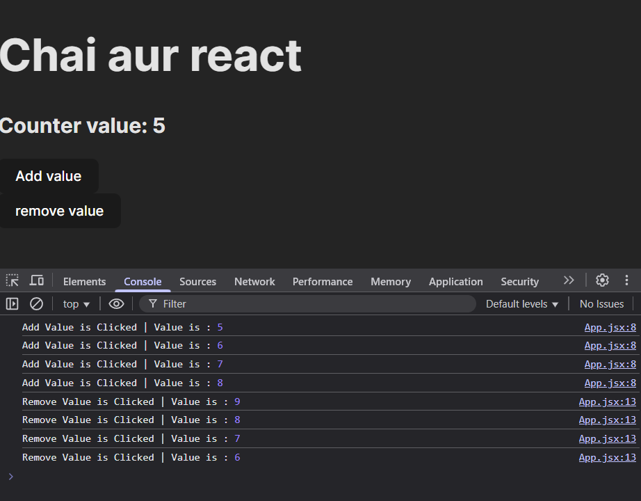

Hooks are very important part of React

- Why do we need Hooks?
Here, we will try to create a COUNTER project and then we will get stuck in a thing, and then there we will use HOOKS and understand why we actually needs Hooks!

Create a new Vite Project and in App.jsx file : 
```jsx
function App() {

  let counter = 5 ; 
  
  const addValue = () => {
    console.log("Add Value is Clicked | Value is :", counter)
    counter = counter + 1
  }

  const removeValue = () => {
    console.log("Remove Value is Clicked | Value is :", counter)
    counter = counter - 1
  }


  return (
    <>
      <h1>Chai aur react</h1>
      <h2>Counter value: {counter}</h2>

      <button
      onClick={addValue}
      >Add value</button> 
      <br />
      <button
      onClick={removeValue}
      >remove value</button>
    </>
  )
}
```

Here, On UI, when we click the Add value button, the counter value should get incremented by 1. Similarly, when we click the remove value button, the counter value should get decremented by 1 and also console the value
Here, the Value is changing in console BUT IT IS NOT CHANGING IN THE UI 

that is, 


THUS, THE PROBLEM IS LYING IN "UI Updation" of Variables!!
React gives us special method like "HOOKS" to solve this problem!

Some Important Hooks are : 
- useState()
- useEffect()
- useContext()
- useReducer()
- useMemo()
- useCallback() and SO ON....
(Each Hook has a separate functionality)

- useState() is used to declare a variable in a functional component and to update the value of that variable.
Thus, to solve our Problem, we need to use "useState()" Hook.

New Code:
```jsx
import './App.css'
import { useState } from 'react' //need to import useState

function App() {

  //useState Hook is a Function which takes the initial value as input parameter and returns 2 things : 
  //1. The current value
  //2. A function to update the current value
  const[counter, setCounter] = useState(5) ; 
  // let counter = 5 ; Not Req anymore as useState is used

  const addValue = () => {
    // counter = counter + 1 
    setCounter(counter + 1)
    console.log("Add Value is Clicked | Value is :", counter)

  }

  const removeValue = () => {
    // counter = counter - 1
    setCounter(counter - 1)
    console.log("Remove Value is Clicked | Value is :", counter)
  }

  return (
    <>
      <h1>Chai aur react</h1>
      <h2>Counter value: {counter}</h2>

      <button
      onClick={addValue}
      >Add value</button> 
      <br />
      <button
      onClick={removeValue}
      >remove value</button>
      <p>Current Value : {counter}</p>
    </>
  )
}

export default App
```


--------------------------------    chatgpt notes    ---------------------------------

# **Lecture 5: Understanding Hooks & The useState Hook in React**

## **1. Why Do We Need Hooks?**
Before React 16.8, managing state and side effects in functional components was not possible. Developers had to use class components for stateful logic. Hooks solve this problem by allowing functional components to use state and lifecycle features.

### **The UI Update Problem**
Consider a simple counter application where clicking a button should increment a counter value. Without state, the UI does not update dynamically.

---
## **2. Introducing the useState Hook**
`useState` is a React Hook that allows functional components to manage state. It returns an array with two elements:
1. The current state value.
2. A function to update the state.

### **Syntax:**
```javascript
const [state, setState] = useState(initialValue);
```

- `state`: The current state value.
- `setState`: Function to update the state.
- `initialValue`: The initial state value (e.g., `0`, `"Hello"`, `true`).

---
## **3. Implementing a Counter App with useState**
Let's build a simple counter application using the `useState` hook.

### **Step 1: Setting Up the Component**
```javascript
import React, { useState } from "react";

function Counter() {
    const [count, setCount] = useState(0);

    return (
        <div>
            <h1>Counter: {count}</h1>
            <button onClick={() => setCount(count + 1)}>Increment</button>
        </div>
    );
}

export default Counter;
```

### **Step 2: Rendering the Component in App.js**
```javascript
import React from "react";
import Counter from "./Counter";

function App() {
    return (
        <div>
            <Counter />
        </div>
    );
}

export default App;
```

### **Explanation:**
- `useState(0)`: Initializes state `count` to `0`.
- `setCount(count + 1)`: Updates the state and re-renders the component.
- Clicking the button updates the `count` dynamically in the UI.

---
## **4. Key Features & Best Practices**
✅ Always use `useState` inside functional components.
✅ Do **not** modify state directly (`count = count + 1` is incorrect).
✅ If the new state depends on the previous state, use a callback:
```javascript
setCount(prevCount => prevCount + 1);
```
✅ State updates are asynchronous.
✅ Multiple state variables can be managed using separate `useState` calls.

---
## **5. Common Mistakes & Exceptions**
❌ **Calling useState Outside Components**
```javascript
const [count, setCount] = useState(0); // Incorrect outside component
```
✅ **Correct Usage:** Place inside the component function.

❌ **Direct State Modification**
```javascript
count = count + 1; // Incorrect
```
✅ **Use setState:**
```javascript
setCount(count + 1); // Correct
```

---
## **6. Interview Questions & Answers**
### **Q1: What is the useState Hook?**
**Answer:** `useState` is a Hook that allows functional components to manage state by returning a state variable and an update function.

### **Q2: What is the difference between `useState` and class-based state?**
**Answer:** `useState` allows functional components to have state without converting them into class components.

### **Q3: Why should we use the updater function (`prevState => newState`) instead of `setState(value)`?**
**Answer:** When the new state depends on the previous state, using the callback ensures we always get the latest state value.

### **Q4: What happens if we call `useState` multiple times in a component?**
**Answer:** Multiple state variables are created, each managing independent pieces of state.

### **Q5: Can we use an object or array as state in `useState`?**
**Answer:** Yes, but updates should be done immutably:
```javascript
const [user, setUser] = useState({ name: "John", age: 25 });
setUser(prevUser => ({ ...prevUser, age: 26 }));
```

---
## **7. Revision Recap**
✅ **useState** is used to manage state in functional components.
✅ **State updates** are asynchronous and should be done using `setState`.
✅ **Always use the previous state callback** if the update depends on the current state.
✅ **Avoid modifying state directly**; always use `setState`.
✅ **State can hold primitives, objects, or arrays**, but updates should be immutable.

---
## **Final Thought**
Understanding `useState` is crucial for mastering React hooks. It simplifies state management in functional components, making them more powerful and easier to maintain.

---

This document covers all essential concepts, exceptions, key takeaways, and probable interview questions. Let me know if you need modifications! 🚀

